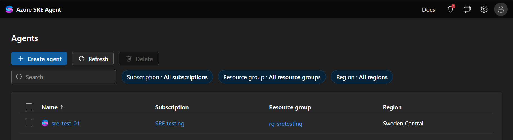
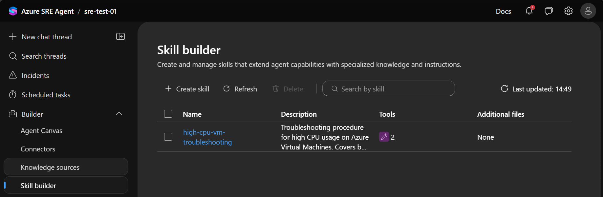
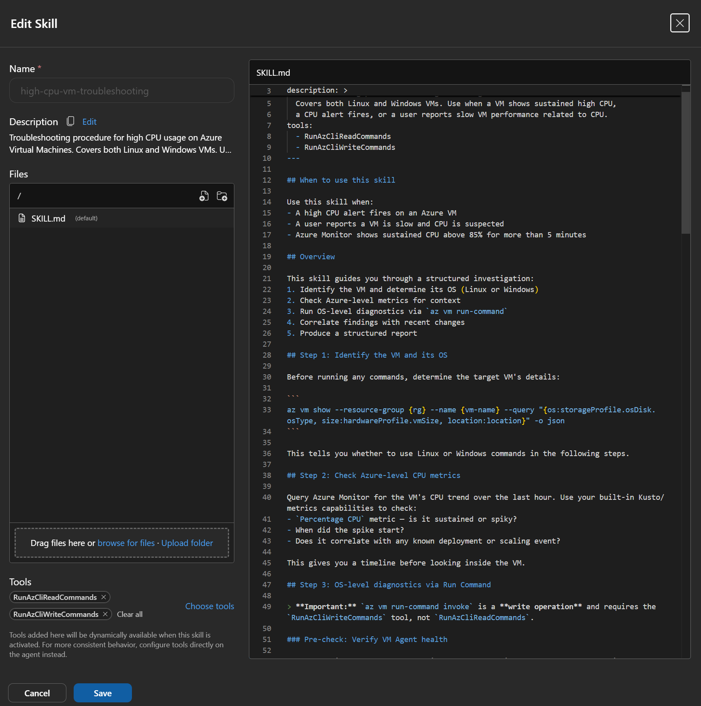

# Azure SRE Agent — Skills, Hooks & Deployment Guide

> Last verified against Azure SRE Agent documentation: April 2026

> A community starter kitfor [Azure SRE Agent](https://sre.azure.com): **10 VM troubleshooting skills**, **8 governance hooks**, Bicep deployment templates, and step-by-step guides to get started quickly.
>
> ⚠️ **Example content** — all skills and hooks in this repo were created with [GitHub Copilot CLI](https://githubnext.com/projects/copilot-cli) as starting points. Test and customize for your environment before production use. **Use at your own risk.**

[Azure SRE Agent](https://sre.azure.com) is an AI-powered operations assistant that diagnoses, triages, and remediates Azure infrastructure issues. It's genuinely powerful on its own — it can [reason through problems](https://sre.azure.com/docs/concepts/agent-reasoning) iteratively, [learn from past incidents](https://sre.azure.com/docs/concepts/memory), run tools in parallel, and adapt its investigation depth to the complexity of the issue.

**So why this repo?** Because the agent's built-in intelligence works best when combined with **your team's specific knowledge**. Skills encode your proven troubleshooting procedures, safety requirements, and organizational standards. Hooks enforce governance guardrails. Together, they turn a capable general-purpose agent into a team member who knows how _you_ operate. See [Why and When to Use Skills](docs/why-and-when-to-use-skills.md) and [Why and When to Use Hooks](docs/why-and-when-to-use-hooks.md) for the full picture.

This repo gives you **example skills and hooks** you can use as starting points — test, customize, and extend them for your environment.

> **Scope:** This repo focuses on **skills and hooks** — it's not a comprehensive Azure SRE Agent guide. For full documentation on agent setup, connectors, memory, run modes, and more, see the [official docs](https://sre.azure.com/docs). The repo may expand to cover additional topics over time.



> 💡 **Tip:** This entire repo — every skill, hook, Bicep template, and doc — was built with [GitHub Copilot](https://github.com/features/copilot). I strongly recommend using it to create your own skills and hooks, customize deployments, and work with the Azure SRE Agent in general. It makes the process dramatically faster. See our guide: **[Creating Skills with Copilot →](docs/creating-skills-and-hooks-with-copilot.md)**

---

## Why skills?

The agent can reason through problems without any skills. But skills add critical value for production operations:

| Benefit | What it means |
|---------|---------------|
| **Consistency** | Same diagnostic procedure every time — not variable reasoning across engineers or shifts |
| **Your knowledge encoded** | Your thresholds, escalation paths, naming conventions, and architecture details — baked in |
| **Execution + safety** | Skills attach tools that actually run commands, with prescribed safety checks before any changes |
| **Structured output** | Standardized reports with evidence, severity, and recommendations — ready for handoff or audit |

**When to create a skill:** You have a proven procedure that recurs, involves safety-critical steps, or needs consistent output. **When to skip:** The problem is novel, one-off, or simple enough for the agent to handle ad-hoc.

📖 **[Full guide: Why and When to Use Skills →](docs/why-and-when-to-use-skills.md)**

---

## Quick start

Get your first skill running in 5 steps. This uses [`high-cpu-vm-troubleshooting`](skills/vm/high-cpu-vm-troubleshooting/) as an example — swap in any skill from the [skills table](#skills) below.

### 1. Clone the repo

```bash
git clone https://github.com/raskip/azure-sre-agent-stuff.git
cd azure-sre-agent-stuff

# Or pull latest if you already have it
git pull origin main
```

### 2. Deploy the agent

```bash
az deployment sub create \
    --subscription "<your-subscription-id>" \
    --location "eastus2" \
    --template-file infra/minimal-sre-agent.bicep \
    --parameters \
        agentName="sre-agent-001-eastus2" \
        subscriptionId="<your-subscription-id>" \
        deploymentResourceGroupName="rg-sre-agent-001-eastus2" \
        location="eastus2" \
        accessLevel="High" \
        'targetResourceGroups=["rg-sre-demo-eastus2"]' \
        'targetSubscriptions=["<your-subscription-id>"]'
```

> See [`infra/README.md`](infra/README.md) for the PowerShell deploy script, naming conventions, and access level options.

### 3. Add your first skill

This step is done in the portal — there's no CLI for skill management yet.

1. Open [sre.azure.com](https://sre.azure.com) → select your agent
2. Go to **Builder** → **Create** → **Skill**
3. Name it `high-cpu-vm-troubleshooting`
4. Paste the contents of [`skills/vm/high-cpu-vm-troubleshooting/SKILL.md`](skills/vm/high-cpu-vm-troubleshooting/SKILL.md) into the skill editor
5. Click **Choose tools** → select `RunAzCliReadCommands` and `RunAzCliWriteCommands`
6. Click **Create**

<details>
<summary>📸 What this looks like in the portal</summary>

**Skill creation dialog:**



**Tool picker:**



</details>

> See [`skills/README.md`](skills/README.md) for tool requirements and tips on adding skills.

### 4. Deploy a test VM

```bash
# Create resource group (if not created by the Bicep deployment)
az group create \
    --name rg-sre-demo-eastus2 \
    --location eastus2

# Deploy a test VM
az vm create \
    --resource-group rg-sre-demo-eastus2 \
    --name vm-sre-demo-cpu \
    --image Ubuntu2404 \
    --size Standard_D2s_v5 \
    --admin-username azureuser \
    --generate-ssh-keys

# Simulate high CPU (runs stress-ng for 5 minutes)
az vm run-command invoke \
    --resource-group rg-sre-demo-eastus2 \
    --name vm-sre-demo-cpu \
    --command-id RunShellScript \
    --scripts "apt-get update -qq && apt-get install -y -qq stress-ng && nohup stress-ng --cpu 0 --timeout 300s &"
```

### 5. Ask the agent

Open your agent at [sre.azure.com](https://sre.azure.com) and try:

> *"Investigate high CPU on vm-sre-demo-cpu in resource group rg-sre-demo-eastus2"*

The agent will activate the skill, run diagnostics via Azure CLI, and produce a structured report with findings and recommendations.

**Cleanup when done:**

```bash
az group delete --name rg-sre-demo-eastus2 --yes --no-wait
```

---

## Skills

All skills live in [`skills/`](skills/). Currently focused on **VM troubleshooting** — more domains (AKS, networking, etc.) coming soon.

| Skill | Type | Description |
|-------|------|-------------|
| [`disk-expansion`](skills/vm/disk-expansion/) | Remediation | Expand VM disks when space is low |
| [`high-cpu-vm-troubleshooting`](skills/vm/high-cpu-vm-troubleshooting/) | Diagnostic | Diagnose high CPU — top processes, per-core breakdown |
| [`high-memory-oom-troubleshooting`](skills/vm/high-memory-oom-troubleshooting/) | Diagnostic | Diagnose memory pressure, swap, OOM kills |
| [`vm-connectivity-troubleshooting`](skills/vm/vm-connectivity-troubleshooting/) | Diagnostic | Diagnose SSH/RDP failures — NSGs, routes, OS firewall |
| [`service-crash-loop-detection`](skills/vm/service-crash-loop-detection/) | Diagnostic | Investigate services that keep crashing |
| [`security-incident-triage`](skills/vm/security-incident-triage/) | Diagnostic | Triage brute-force attempts, rogue processes, open ports |
| [`vm-right-sizing`](skills/vm/vm-right-sizing/) | Advisory | Analyze utilization and recommend optimal VM SKU |
| [`backup-health-verification`](skills/vm/backup-health-verification/) | Diagnostic | Verify Azure Backup config, recovery points, failed jobs |
| [`vm-extension-failure-remediation`](skills/vm/vm-extension-failure-remediation/) | Remediation | Diagnose and fix failed VM extensions |
| [`disk-iops-throttling`](skills/vm/disk-iops-throttling/) | Diagnostic | Investigate disk IOPS/throughput throttling |

---

## Why hooks?

The agent has built-in safety — action classification, review mode, and judgment-based protection. But hooks add what built-in safety can't: **deterministic, organization-specific governance that runs automatically, every time.**

| Benefit | What it means |
|---------|---------------|
| **Deterministic enforcement** | A rule that blocks `rm -rf` will always block it — no reasoning, no exceptions |
| **Quality gates** | Every response must cite evidence, include a summary, follow your format |
| **Audit & compliance** | Log every tool call with context — agent name, turn, tool, success/failure |
| **Operational guardrails** | Read-only mode, VM deletion prevention, allowlist-only remediation |

**When to create a hook:** You need a rule enforced every time, an audit trail, or a minimum quality bar. **When to skip:** The environment is non-critical, you're exploring, or run modes already provide enough control.

📖 **[Full guide: Why and When to Use Hooks →](docs/why-and-when-to-use-hooks.md)**

---

## Hooks

Hooks are governance guardrails that intercept agent behavior at key execution points. All hooks live in [`hooks/`](hooks/).

| Hook | Type | Description |
|------|------|-------------|
| [`require-summary-section`](hooks/examples/require-summary-section.yaml) | Stop | Reject responses that lack a Summary section |
| [`enforce-structured-response`](hooks/examples/enforce-structured-response.yaml) | Stop | Require a specific output format (severity, findings, actions) |
| [`require-evidence-in-diagnostics`](hooks/examples/require-evidence-in-diagnostics.yaml) | Stop | Ensure the agent cites actual command output as evidence |
| [`restrict-to-readonly`](hooks/examples/restrict-to-readonly.yaml) | PostToolUse | Block write operations — agent can diagnose but not change anything |
| [`block-dangerous-commands`](hooks/examples/block-dangerous-commands.yaml) | PostToolUse | Block `rm -rf`, `format`, `Stop-Computer`, and other destructive commands |
| [`block-vm-deletion`](hooks/examples/block-vm-deletion.yaml) | PostToolUse | Prevent the agent from deleting VMs |
| [`audit-all-tool-usage`](hooks/examples/audit-all-tool-usage.yaml) | PostToolUse | Log every tool invocation for diagnostic/demo auditing |
| [`allowlist-remediation`](hooks/examples/allowlist-remediation.yaml) | PostToolUse | Only allow pre-approved remediation commands |

See the [Hooks Guide](hooks/README.md) for concepts, configuration reference, and best practices.

---

## Repo structure

```
azure-sre-agent-stuff/
├── README.md                          ← You are here
├── skills/
│   ├── README.md                      ← Skills overview & how to add them
│   └── vm/
│       ├── README.md                  ← VM skills guide & testing playbook
│       ├── disk-expansion/
│       ├── high-cpu-vm-troubleshooting/
│       ├── high-memory-oom-troubleshooting/
│       ├── vm-connectivity-troubleshooting/
│       ├── service-crash-loop-detection/
│       ├── security-incident-triage/
│       ├── vm-right-sizing/
│       ├── backup-health-verification/
│       ├── vm-extension-failure-remediation/
│       └── disk-iops-throttling/
├── hooks/
│   ├── README.md                      ← Hooks guide & configuration reference
│   └── examples/                      ← Ready-to-use hook YAML files
├── demos/                             ← Customer demo playbooks (5/15/30 min)
│   ├── README.md                      ← Demo overview & prerequisites
│   ├── 01-quick-wow-high-cpu.md       ← 5-min "wow moment" — CPU diagnosis
│   ├── 02-governance-hooks.md         ← 10-min enterprise guardrails
│   ├── 03-business-value-right-sizing.md  ← 10-min cost optimization
│   └── 04-full-demo-script.md         ← 30-min complete demo flow
├── infra/                             ← Bicep templates for agent + test VMs
└── docs/
    ├── why-and-when-to-use-skills.md
    ├── why-and-when-to-use-hooks.md
    └── creating-skills-and-hooks-with-copilot.md
```

---

## How to add skills to your agent

1. Open [sre.azure.com](https://sre.azure.com) and select your agent.
2. Go to **Agent Canvas** → **Custom agents** → **Create** → **Skill**.
3. Give the skill a name (e.g., `high-cpu-vm-troubleshooting`).
4. Paste the contents of the skill's `SKILL.md` file into the prompt field.
5. Attach the required tools (typically `RunAzCliReadCommands` + `RunAzCliWriteCommands`).
6. Click **Save**.

The agent will automatically invoke the skill when a user's question matches its domain.

See [`skills/README.md`](skills/README.md) for detailed instructions and tool requirements.

---

## How to add hooks

1. Open [sre.azure.com](https://sre.azure.com) and select your agent.
2. Go to **Builder** → **Hooks** tab → **Create hook**.
3. Choose the event type (**Stop** or **PostToolUse**) and execution type (**Prompt** or **Code**).
4. Paste the hook content from the corresponding YAML file in [`hooks/examples/`](hooks/examples/).
5. Click **Save**.

See [`hooks/README.md`](hooks/README.md) for the full configuration reference and best practices.

---

## Creating new skills and hooks

Want to build your own? See the guide: **[Creating Skills and Hooks](docs/creating-skills-and-hooks-with-copilot.md)**.

Key principles for writing good skills:
- Be specific — include exact CLI commands and expected output formats
- Cover both Linux and Windows where applicable
- Include safety checks before any remediation steps
- Specify the output format you expect from the agent

---

## Resources

| Resource | Link |
|----------|------|
| Azure SRE Agent portal | [sre.azure.com](https://sre.azure.com) |
| Official documentation | [Azure SRE Agent docs](https://learn.microsoft.com/azure/sre-agent/) |
| GitHub repo (Microsoft) | [microsoft/sre-agent](https://github.com/microsoft/sre-agent) |
| SRE Agent concepts | [Skills](https://sre.azure.com/docs/concepts/skills) · [Hooks](https://sre.azure.com/docs/capabilities/agent-hooks) · [Run modes](https://learn.microsoft.com/azure/sre-agent/run-modes) |

---

## License

This project is licensed under the [MIT License](LICENSE).


